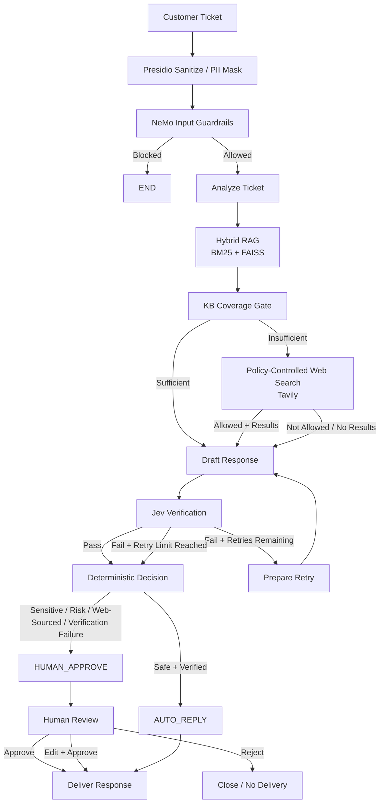

# Support Ticket Triage & Resolution Agent

A production-oriented support-ticket triage and resolution system built around **LangGraph orchestration**, **LangChain components**, **Microsoft Presidio PII protection**, **NeMo Guardrails**, **hybrid RAG**, **policy-controlled web search**, **Jev verification**, deterministic routing, **human-in-the-loop review**, and **SQLite persistence**.

The system accepts a customer support ticket, protects sensitive information, checks for unsafe or adversarial input, analyzes the issue, retrieves relevant internal knowledge, decides whether the knowledge base is sufficient, optionally performs policy-controlled web search, drafts an evidence-grounded response, verifies that response with Jev, and finally routes it either to automatic delivery or human review.

Currently Deployed on AWS EC2 at: http://3.13.169.209:8000 
---

## Table of Contents

- [Architecture](#architecture)
- [Core Workflow](#core-workflow)
- [Key Design Principles](#key-design-principles)
- [Technology Stack](#technology-stack)
- [Project Structure](#project-structure)
- [Prerequisites](#prerequisites)
- [Installation](#installation)
- [Environment Variables](#environment-variables)
- [Running the Application](#running-the-application)
- [Using the Dashboard](#using-the-dashboard)
- [API](#api)
- [SQLite Persistence](#sqlite-persistence)
- [Knowledge Base and Retrieval](#knowledge-base-and-retrieval)
- [Web Search Policy](#web-search-policy)
- [Human-in-the-Loop](#human-in-the-loop)
- [Verification and Retry](#verification-and-retry)
- [Testing](#testing)
- [Development Notes](#development-notes)
- [Current Scope](#current-scope)
- [Roadmap](#roadmap)

---

## Architecture

The system separates **workflow orchestration** from the individual AI and infrastructure components.



### Responsibility Boundaries


## Core Workflow

Every ticket follows the same controlled workflow.

### 1. Sanitize

Microsoft Presidio analyzes the incoming ticket and masks sensitive information before downstream model and web boundaries.

The original message is retained in the persisted ticket state, while downstream processing uses the masked message.

Typical sensitive information includes:

- Email addresses
- Phone numbers
- Student IDs
- Roll numbers
- Aadhaar-like identifiers
- Other configured PII patterns

### 2. Input Guardrails

The sanitized message is evaluated by the input safety layer.

Unsafe or prompt-injection-like input can be blocked before the ticket reaches the main reasoning workflow.

When the guardrail blocks a ticket, the graph terminates the downstream processing path.

### 3. Ticket Analysis

The LLM produces structured ticket analysis:

- Issues
- Primary category
- Urgency
- Complexity
- Anger score
- Risk flags

### 4. Hybrid Retrieval

The system retrieves relevant internal knowledge using:

- BM25 lexical retrieval
- FAISS/vector retrieval
- Ensemble/hybrid retrieval

The internal knowledge base is stored in:

```text
kb/documents.json
```

### 5. KB Coverage Gate

A dedicated structured LLM call evaluates whether the retrieved internal KB actually contains enough information to answer the ticket.

This prevents the system from assuming that a semantically similar document is sufficient.

The coverage evaluator also classifies missing information into a source type:

- `institute_info`
- `public_exam_info`
- `general_knowledge`
- `private_account_data`
- `other`

### 6. Controlled Web Search

If the KB is insufficient, the system can use Tavily.

Web search is not unconditional.

The source type is checked against:

```text
config/web_policy.yaml
```

For example, the current policy enables:

```yaml
institute_info:
  enabled: true

public_exam_info:
  enabled: true

general_knowledge:
  enabled: true
```

while private-account information and unspecified sources are disabled by default.

The web search receives the **masked** ticket, not the raw customer message.

### 7. Response Drafting

The response LLM receives the available evidence and generates a structured response.

The drafting layer is instructed to:

- Use only supplied evidence
- Avoid unsupported claims
- Use evidence-source citation IDs
- Avoid exposing private/redacted information
- Avoid exposing internal reasoning
- Use verification feedback when regenerating a response

### 8. Jev Verification

Jev independently evaluates the draft through the Vercel AI Gateway.

The current verification checks include:

- Grounding
- Citation support

The verification result is stored in the ticket state.

### 9. Controlled Retry

If verification does not meet the configured threshold, the graph can regenerate the response using verification feedback.

The retry loop is bounded by `MAX_RETRIES`.

This prevents an uncontrolled agentic loop.

### 10. Deterministic Decision

The final routing decision is made by explicit Python logic rather than asking another LLM to decide whether a response should be sent.

Examples of conditions that can cause human routing include:

- Verification failure
- Sensitive categories such as payment/refund
- Risk flags
- Web-sourced responses
- Required web search that produced no usable result
- Other fail-closed conditions

The result is generally one of:

```text
AUTO_REPLY
HUMAN_APPROVE
```

### 11. Human Review

When a ticket requires review, the reviewer can:

- Approve
- Approve with edit
- Reject

The resulting state is persisted back into SQLite.

---

## Key Design Principles

### Fail closed

The system should not invent missing information.

If evidence is insufficient, external information is unavailable or verification fails after the allowed retry, the ticket is routed toward human review.

### Evidence before generation

The response-generation stage receives retrieved evidence rather than being allowed to freely answer from model knowledge.

### Verification is separate from generation

The component that generates the response is not the same logical step that verifies it.

### Deterministic final routing

The final delivery decision is implemented in Python so the business gate is explicit and inspectable.

### PII protection before external boundaries

External web search operates on the sanitized message.

### Bounded agent behavior

The verification retry is explicitly limited by `MAX_RETRIES`.

### Durable state

Ticket state is persisted in SQLite rather than being kept only in application memory.

---

## Technology Stack

### Backend

- Python 3.12+
- FastAPI
- Uvicorn
- Pydantic

### Orchestration

- LangGraph
- LangChain
- LangChain Core
- LangChain Community
- LangChain OpenAI

### LLM Gateway

- Vercel AI Gateway

The current gateway is configured in:

```text
gateway/vercel.py
```

### Security / Safety

- Microsoft Presidio
- NeMo Guardrails

### Retrieval

- BM25
- FAISS
- OpenAI `text-embedding-3-small` through Vercel AI Gateway

### External Search

- Tavily

### Verification

- Jev through Vercel AI Gateway

### Persistence

- SQLite

### Frontend

- HTML
- CSS
- Vanilla JavaScript

### Development

- uv
- pytest

---

## Project Structure

```text
Support-Ticket-Agent/
│
├── app/
│   ├── __init__.py
│   ├── main.py                 # FastAPI application
│   ├── database.py             # SQLite persistence
│   ├── schemas.py              # Structured Pydantic models
│   └── streamlit_app.py        # Development/alternative UI
│
├── config/
│   └── web_policy.yaml         # External-search policy
│
├── frontend/
│   ├── index.html              # Main dashboard
│   ├── app.js                  # Dashboard behavior/API client
│   ├── styles.css              # Dashboard styling
│   └── icon.svg
│
├── gateway/
│   ├── prompts.py              # LLM prompts
│   └── vercel.py               # Vercel AI Gateway integration
│
├── graph/
│   ├── graph.py                # LangGraph workflow
│   ├── state.py                # TicketState
│   └── nodes/
│       ├── analyzer.py
│       ├── coverage.py
│       ├── decision.py
│       ├── drafting.py
│       ├── guardrails.py
│       ├── retrieval.py
│       ├── sanitize.py
│       ├── verification.py
│       └── web_search.py
│
├── guardrails/
│   ├── config/
│   │   ├── config.yml
│   │   ├── prompts.yml
│   │   └── rails.co
│   ├── input.py
│   └── pii.py
│
├── human_review/
│   └── human_review.py
│
├── kb/
│   └── documents.json         # Internal support knowledge base
│
├── retrieval/
│   ├── bm25.py
│   ├── embeddings.py
│   ├── hybrid.py
│   ├── loader.py
│   └── vector.py
│
├── web/
│   ├── policy.py
│   └── tavily.py
│
├── tests/
│   ├── test_coverage.py
│   ├── test_decision.py
│   ├── test_embedding.py
│   ├── test_graph.py
│   ├── test_guardrails.py
│   ├── test_human_review.py
│   ├── test_jev.py
│   ├── test_llm.py
│   ├── test_openrouter.py
│   ├── test_pii.py
│   ├── test_retrieval.py
│   ├── test_sanitize.py
│   ├── test_web_policy.py
│   ├── test_web_search.py
│   ├── test_database.py
│   └── test_ticket_history.py
│
├── .python-version
├── pyproject.toml
├── requirements.txt
└── README.md
```

---

## Prerequisites

### Python

The project requires:

```text
Python >= 3.12
```

The repository also contains:

```text
.python-version
```

with Python 3.12.

### Recommended package manager

The project is configured for **uv**.

Install uv according to your operating system, then verify:

```bash
uv --version
```

You also need API credentials for the external services used by the application.

---

## Installation

Clone the repository:

```bash
git clone <your-repository-url>
cd Support-Ticket-Agent
```

Create the virtual environment and install dependencies:

```bash
uv sync
```

Activate the environment if desired.

### Windows

```powershell
.venv\Scripts\activate
```

### Linux / macOS

```bash
source .venv/bin/activate
```

You can also run project commands through uv without manually activating the environment.

---

## Environment Variables

Create a `.env` file in the project root:

```env
AI_GATEWAY_API_KEY=your_vercel_ai_gateway_key
TAVILY_API_KEY=your_tavily_api_key
```

Optional:

```env
LLM_MODEL=openai/gpt-6-luna
```

### `AI_GATEWAY_API_KEY`

Used by:

- Ticket analysis
- KB coverage evaluation
- Response generation
- Embeddings
- Jev verification

The gateway endpoint is:

```text
https://ai-gateway.vercel.sh/v1
```

### `TAVILY_API_KEY`

Required when the workflow reaches a policy-approved web-search path.

### Security

Never commit `.env` or API keys.

The repository should keep secrets out of Git history.

---

## Running the Application

### Start FastAPI

From the repository root:

```bash
uv run uvicorn app.main:app --reload
```

The dashboard is then available at:

```text
http://127.0.0.1:8000
```

The API documentation is available at:

```text
http://127.0.0.1:8000/docs
```

### Health check

Open:

```text
http://127.0.0.1:8000/health
```

Expected response:

```json
{
  "status": "ok",
  "service": "support-ticket-agent",
  "persistence": "sqlite"
}
```

---

## Using the Dashboard

Open:

```text
http://127.0.0.1:8000
```

The dashboard provides:

- Ticket submission
- Workflow execution status
- Sanitization information
- Guardrail status
- Ticket analysis
- Retrieval evidence
- KB coverage decision
- Web-search status
- Jev verification
- Retry state
- Final routing decision
- Human-review controls
- Ticket history

### Submit a ticket

Enter a support message and run the workflow.

Example:

```text
I cannot access my course recordings.
```

The dashboard will show the executed route.

### Example KB-supported route

```text
Sanitize
   ↓
Guardrails
   ↓
Analyze
   ↓
Hybrid RAG
   ↓
Coverage
   ↓
Draft
   ↓
Jev
   ↓
Decision
   ↓
AUTO_REPLY
```

### Example web-fallback route

```text
Sanitize
   ↓
Guardrails
   ↓
Analyze
   ↓
Hybrid RAG
   ↓
Coverage = insufficient
   ↓
Policy check
   ↓
Tavily
   ↓
Draft
   ↓
Jev
   ↓
Decision
```

Web-sourced responses are currently routed through the human-review path by the deterministic decision policy.

---

## API

### Health

```http
GET /health
```

### Create ticket

```http
POST /api/tickets
```

Example:

```json
{
  "message": "I cannot access my course recordings.",
  "channel": "web"
}
```

Optional explicit ticket ID:

```json
{
  "ticket_id": "WEB-001",
  "message": "I cannot access my course recordings.",
  "channel": "web"
}
```

### Get ticket

```http
GET /api/tickets/{ticket_id}
```

Returns the complete persisted `TicketState`.

### Ticket history

```http
GET /api/tickets
```

Optional parameters:

```text
limit
offset
decision
```

Examples:

```text
/api/tickets?limit=20
/api/tickets?offset=20
/api/tickets?decision=HUMAN_APPROVE
```

The history endpoint returns lightweight ticket metadata and a sanitized message preview.

### Human review

```http
POST /api/tickets/{ticket_id}/review
```

Approve:

```json
{
  "action": "approve",
  "reviewer_note": "Reviewed and approved.",
  "edited_response": ""
}
```

Reject:

```json
{
  "action": "reject",
  "reviewer_note": "Requires manual handling.",
  "edited_response": ""
}
```

Approve with edit:

```json
{
  "action": "edit",
  "reviewer_note": "Clarified the response.",
  "edited_response": "Updated customer response."
}
```

---

## SQLite Persistence

Ticket persistence is implemented in:

```text
app/database.py
```

The database is automatically created at:

```text
data/support_tickets.sqlite3
```

The `data` directory does not need to be created manually.

The database stores:

- Ticket ID
- Complete serialized `TicketState`
- Creation timestamp
- Update timestamp
- Decision
- Review status
- Delivery status
- Primary category

SQLite uses WAL mode and a busy timeout for better local concurrency behavior.

### Persistence behavior

Previously:

```text
Application memory
       ↓
ticket_store dictionary
       ↓
Server restart
       ↓
Tickets lost
```

Current behavior:

```text
Application
     ↓
SQLite
     ↓
Server restart
     ↓
Tickets remain available
```

### Database file

The local SQLite database should not be committed to Git.

Recommended `.gitignore` entries:

```gitignore
*.sqlite3
*.sqlite3-shm
*.sqlite3-wal
```

---

## Knowledge Base and Retrieval

The internal knowledge base is:

```text
kb/documents.json
```

Documents contain fields such as:

```json
{
  "id": "kb-001",
  "title": "Course Recording Access",
  "category": "course_access",
  "content": "..."
}
```

Retrieval combines:

### BM25

Implemented in:

```text
retrieval/bm25.py
```

### Vector retrieval

Implemented in:

```text
retrieval/vector.py
```

Embeddings are generated using:

```text
openai/text-embedding-3-small
```

through the Vercel AI Gateway.

### Hybrid retrieval

Implemented in:

```text
retrieval/hybrid.py
```

The hybrid retriever combines lexical and semantic retrieval before the coverage decision.

---

## Web Search Policy

External web search is controlled by:

```text
config/web_policy.yaml
```

Current policy:

```yaml
institute_info:
  enabled: true
  domains: []

public_exam_info:
  enabled: true
  domains: []

general_knowledge:
  enabled: true
  domains: []

private_account_data:
  enabled: false
  domains: []

other:
  enabled: false
  domains: []
```

This means the system does not automatically use external web search for private account information.

The policy is evaluated after KB coverage determines that additional information is required.

---

## Human-in-the-Loop

Human review is implemented in:

```text
human_review/human_review.py
```

The deterministic decision layer can route a response to:

```text
HUMAN_APPROVE
```

The dashboard then allows the reviewer to:

```text
Approve
Approve with Edit
Reject
```

The resulting state is persisted in SQLite.

This keeps human review outside the main automatic routing path while allowing the review result to become part of the durable ticket state.

---

## Verification and Retry

Verification is implemented in:

```text
graph/nodes/verification.py
```

Jev is called through:

```text
gateway/vercel.py
```

The verification questions currently evaluate:

1. Whether the response is grounded in the supplied evidence.
2. Whether the citations are supported by the supplied evidence.

When verification fails, the workflow can regenerate the response using verification feedback.

The retry is bounded by:

```text
MAX_RETRIES
```

After the retry limit is reached, the system does not continue indefinitely.

---

## Testing

Run the full test suite:

```bash
uv run pytest
```

Run with verbose output:

```bash
uv run pytest -v
```

### Persistence tests

```bash
uv run pytest tests/test_database.py -v
```

### Ticket history API tests

```bash
uv run pytest tests/test_ticket_history.py -v
```

### PII tests

```bash
uv run pytest tests/test_pii.py -v
```

### Guardrail tests

```bash
uv run pytest tests/test_guardrails.py -v
```

### Retrieval tests

```bash
uv run pytest tests/test_retrieval.py -v
```

### Decision tests

```bash
uv run pytest tests/test_decision.py -v
```

### Human-review tests

```bash
uv run pytest tests/test_human_review.py -v
```

Some tests that call real external services require valid API credentials and network access.

---

## Development Notes

### Run the graph directly

The graph can be exercised independently of FastAPI through the test scripts.

For example:

```bash
uv run python tests/test_graph.py
```

This executes the LangGraph workflow and prints the final state.

### Test PII masking

```bash
uv run python tests/test_pii.py
```

### Test web policy

```bash
uv run python tests/test_web_policy.py
```

### Test web search

```bash
uv run python tests/test_web_search.py
```

This requires a valid `TAVILY_API_KEY`.

### Alternative Streamlit UI

The repository also contains:

```text
app/streamlit_app.py
```

It can be launched with:

```bash
uv run streamlit run app/streamlit_app.py
```

The primary application interface, however, is the FastAPI-served frontend under:

```text
frontend/
```

---

## Current Scope

The current implementation provides:

- End-to-end LangGraph workflow
- PII sanitization
- Input safety gate
- Structured ticket analysis
- Hybrid internal retrieval
- KB coverage evaluation
- Policy-controlled external search
- Grounded response generation
- Jev verification
- Bounded verification retry
- Deterministic routing
- Human approval/edit/rejection
- SQLite ticket persistence
- Ticket history API
- Ticket history dashboard
- Basic API health endpoint
- Automated tests for major workflow components

---

## Roadmap

The project is being developed toward a more production-oriented support automation architecture.

Planned next layers include:

### Audit trail

Persist important workflow events rather than only the final ticket state.

Examples:

```text
ticket_created
pii_sanitized
guardrail_passed
guardrail_blocked
analysis_completed
retrieval_completed
coverage_decided
web_search_executed
draft_created
verification_completed
retry_triggered
decision_made
human_review_started
human_review_completed
```

### Authentication and authorization

Add authenticated access for support agents and reviewers.

### Observability

Add structured logging and metrics for:

- Workflow latency
- Retrieval latency
- LLM latency
- Verification latency
- Retry rates
- Human-review rates
- Automatic-resolution rates
- Failure modes

### Evaluation

Build a repeatable evaluation dataset covering:

- Normal support tickets
- Missing-KB questions
- Prompt injection
- PII
- Sensitive categories
- Unsupported claims
- Web-search cases
- Verification failures
- Human-review routing

### Production delivery

A future delivery layer can connect approved responses to the actual support channel.

The current system intentionally stops at a safe routing/delivery-ready state rather than automatically sending messages to a real customer system.

---

## Design Philosophy

This project is intentionally designed as a **controlled support workflow**, not a free-form autonomous agent.

The core pattern is:

```text
Protect
  ↓
Constrain
  ↓
Retrieve
  ↓
Evaluate evidence
  ↓
Generate
  ↓
Verify
  ↓
Deterministically route
  ↓
Human review when required
  ↓
Persist
```

The important distinction is that the LLM is responsible for tasks such as analysis, coverage evaluation and response generation, while the system retains explicit control over:

- Safety boundaries
- Data sanitization
- External search policy
- Retry limits
- Final routing
- Human approval
- Persistence

This makes the workflow easier to inspect, test and extend toward production use.
